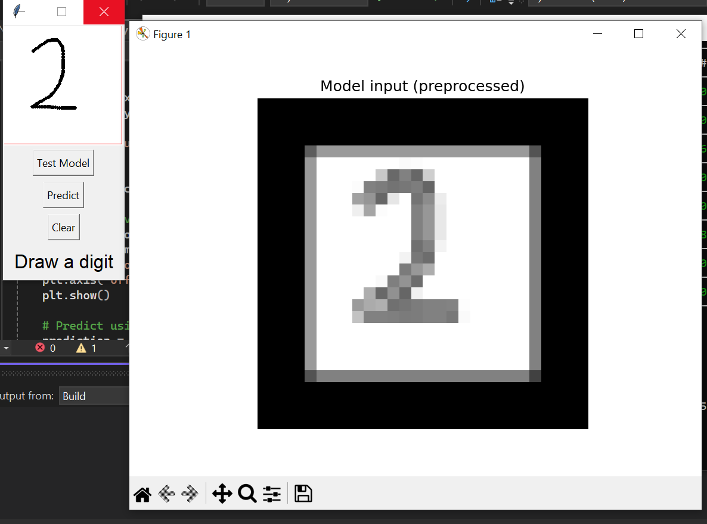
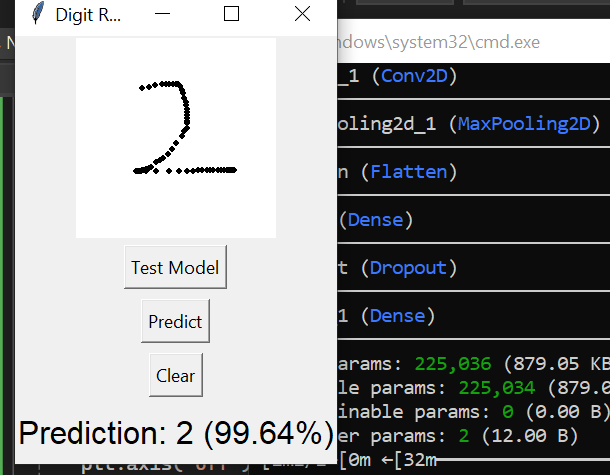
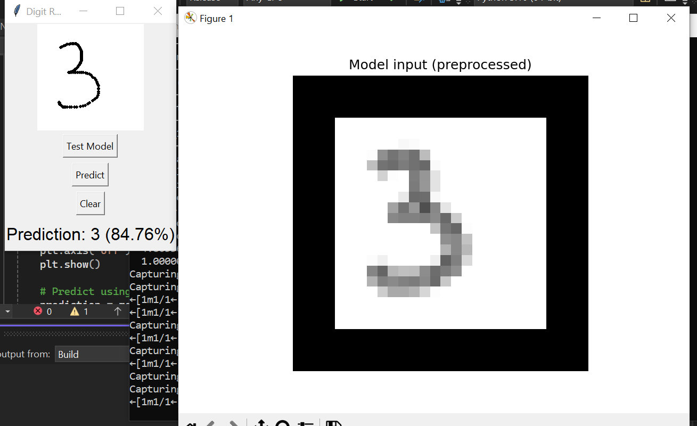
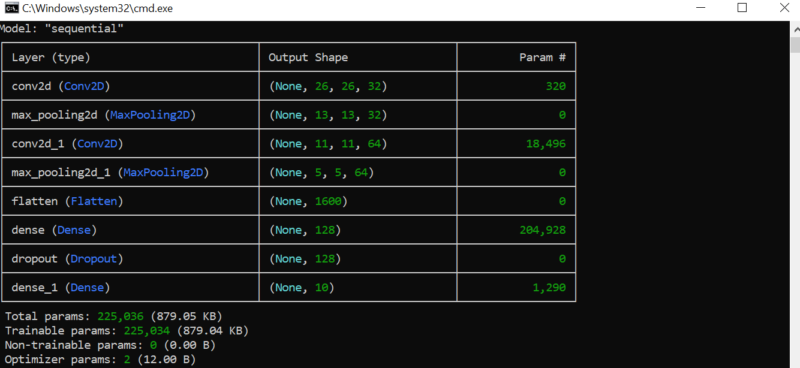

# MNIST-CNN-Recognizer 🧠

A Python-based GUI application to recognize hand-drawn digits (0-9) using a Convolutional Neural Network (CNN) trained on a real-world handwritten digit dataset.

  

## Features ✨
- Interactive Tkinter drawing interface
- Real-time digit prediction
- Image preprocessing with OpenCV
- CNN model trained on diverse handwritten digits
- Probability display for predictions

## Built With 🛠️
- 🖌️ Tkinter - Drawing interface
- 🔍 OpenCV - Image preprocessing
- 🤖 TensorFlow/Keras - Model training and prediction
- 📊 Dataset from [Kaggle](https://www.kaggle.com/datasets/riyaldi/handwriting-digit-0-9)

## Model Architecture 🧠
### Summary


### Layers
- 2× Conv2D + ReLU
- 2× MaxPooling2D
- 1× Dense (128) + Dropout
- Final Softmax (10 outputs)

### Training Settings
- Input shape: (28, 28, 1)
- Optimizer: Adam
- Loss: Categorical Crossentropy
- Epochs: 10

## Dataset 📂
The project uses the Handwriting Digit 0-9 dataset from Kaggle with the following structure:

handDigitDataset/
├── 0/
├── 1/
├── ...
├── 9/

Each folder contains real handwritten digits in .jpg format across various styles and formats.

## How It Works 🚀
1. Draw a digit in the GUI canvas
2. The drawn image is:
   - Captured using ImageGrab
   - Preprocessed with OpenCV (thresholding, resizing, centering)
3. Image is passed to the trained CNN model
4. Prediction is shown with probability

## Project Structure 🏗️
MNIST-CNN-Recognizer/
├── digit_gui.py # GUI interface
├── digit_model.h5 # Trained CNN model
├── mnist-training-code.ipnb # Model training script
├── images/ # Screenshots
└── README.md

## Setup Instructions 🖥️
1. Clone the repository:
```bash
git clone https://github.com/FatimaRana50/MNIST-CNN-Recognizer.git
cd MNIST-CNN-Recognizer
```
2)Install dependencies:

```bash
pip install tensorflow opencv-python pillow numpy matplotlib
```
3Run the GUI:
```
python digit_gui.py
```
Future Improvements 📌
Improve preprocessing pipeline for noisy drawings

Show confidence graph for all 10 digits

Allow live dataset collection from user drawings

Deploy to Streamlit or Flask for web use
Credits 🙌
Dataset: Kaggle Handwriting Digit 0-9

Model & GUI: Built with Python, TensorFlow, Tkinter, and OpenCV


